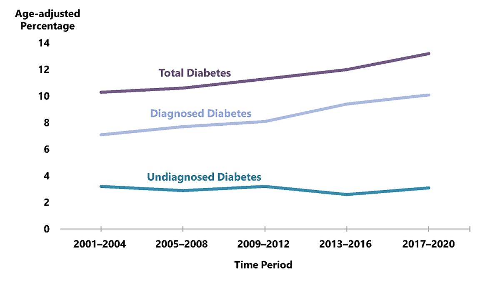

Diabetes is a major public health concern in the United States. According to the Centers for Disease Control and Prevention (CDC), diabetes was the one of the leading causes of death in the United States in 2020 with 103,294 deaths. Beyond its health impact, the economic burden is similarly substantial, with annual costs to patients and the health care system more than $400 billion.

Between 2001 and 2020, the age-adjusted prevalence of diabetes among U.S. adults aged 18 years or older increased significantly. As shown in Figure below, this trend highlights the increasing urgency of addressing diabetes at the population level.

Data sources: 2001–March 2020 National Health and Nutrition Examination Surveys.

As Type 2 diabetes is largely preventable, identifying risk factors such as physical activity, smoking, and blood pressure levels is essential for guiding preventive interventions and health education efforts. 

Our project aims to analyze how behavioral factors are associated with diabetes
prevalence using the CDC’s Behavioral Risk Factor Surveillance System
(BRFSS) data. Also, we aim to develop a predictive model that estimates
diabetes risk based on their health indicators. By the end of this
project, we hope to provide actionable insights into the most influential factors associated with diabetes and to inform effective prevention and health promotion initiatives.

