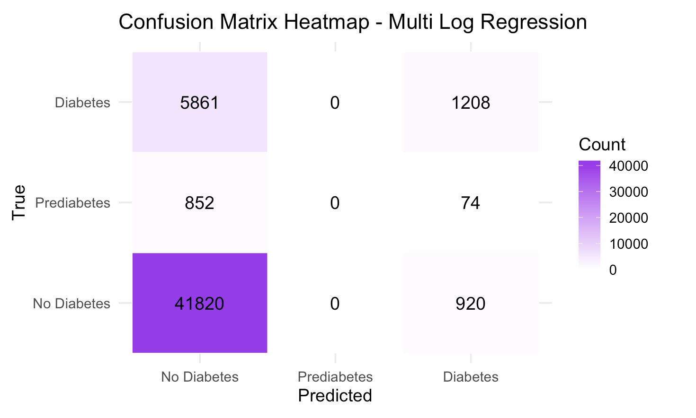
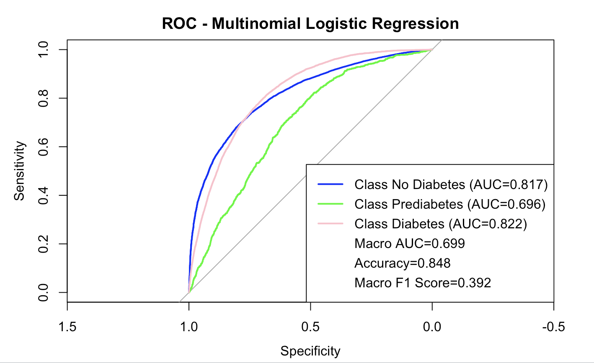
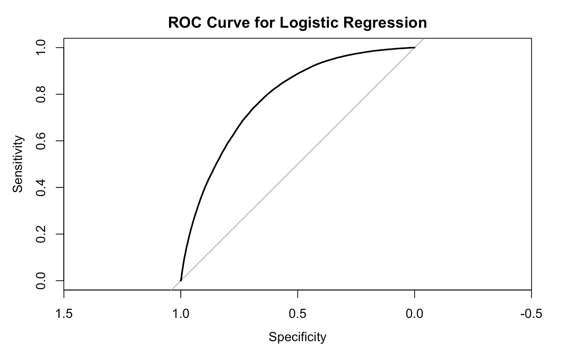
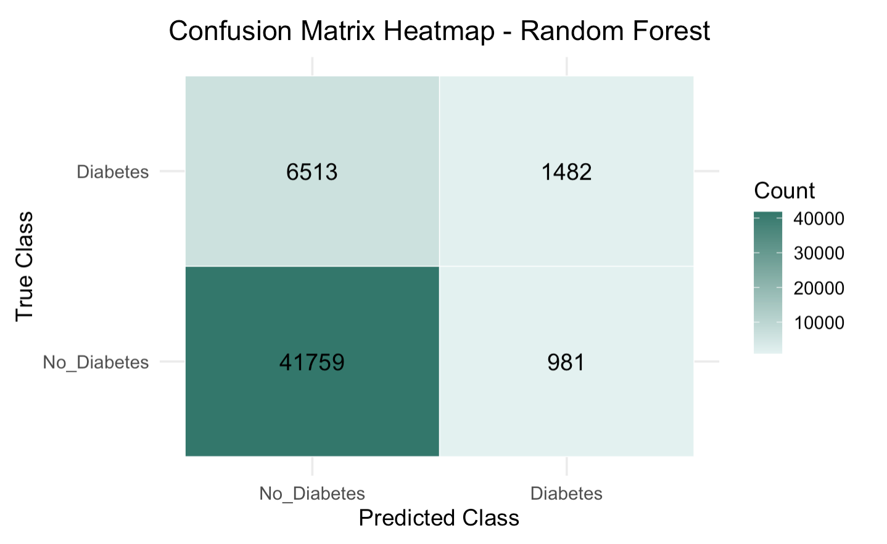
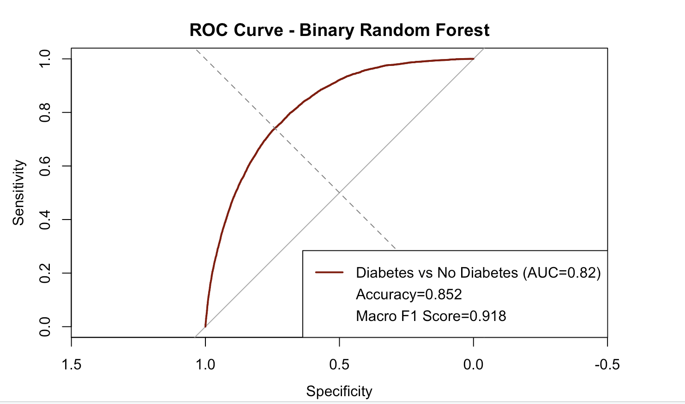
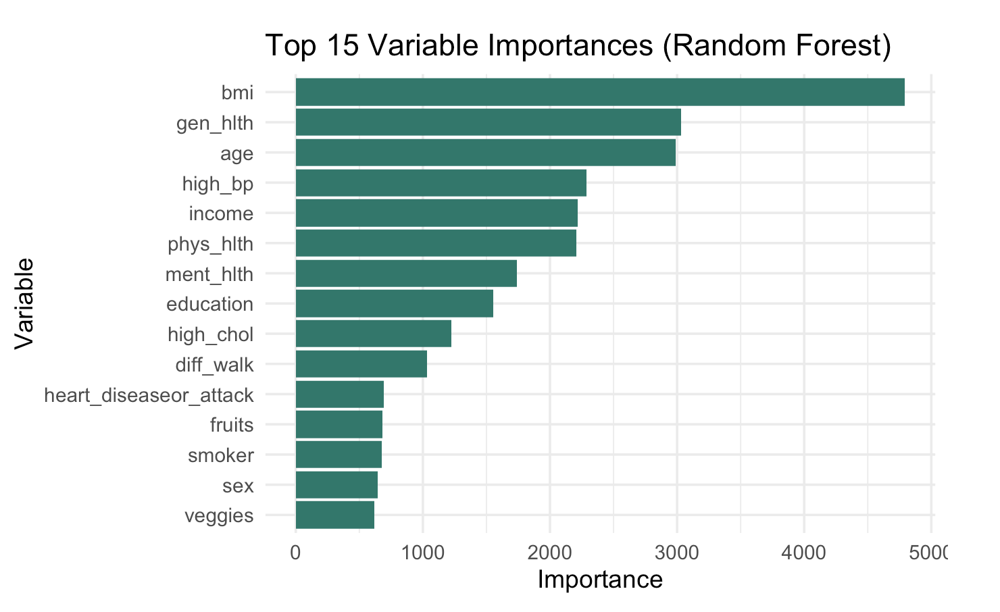
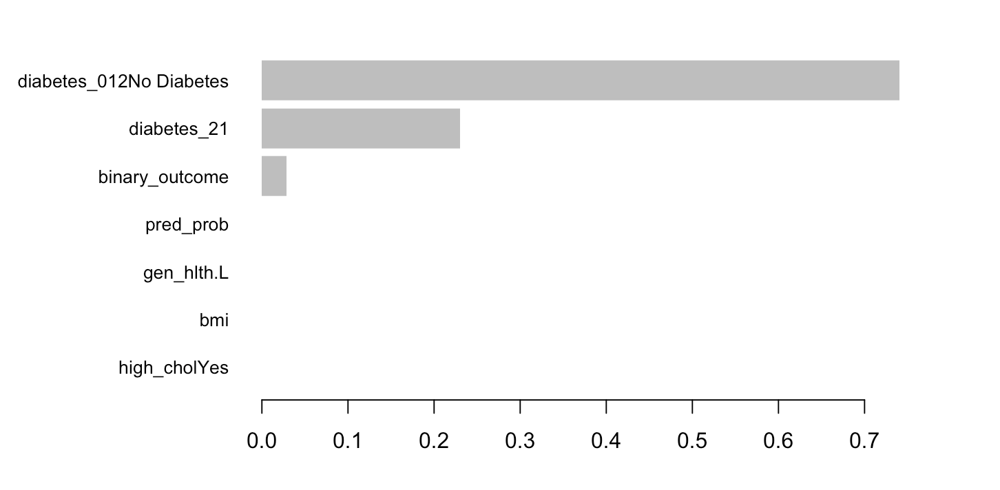

*Yvonne Xie, Rosie Kwon, Vicky Yang, Yiying Chen, Charlotte Zhang*


## Introduction
```{r child="introduction.Rmd"}
```

## Data
```{r child="Data.Rmd"}
```

## Exploratory Data Analysis

```{r, include = FALSE, message = FALSE, warning = FALSE}
# Load required libraries
library(tidyverse)
library(rvest)
library(plotly)

diabetes <- readRDS("clean_diabetes_data.rds")
  
binary_vars = c(
  "high_bp", "high_chol", "chol_check",
  "smoker", "stroke", "heart_diseaseor_attack",
  "phys_activity", "hvy_alcohol_consump", "any_healthcare",
  "no_docbc_cost", "diff_walk", "fruits", "veggies"
)
```


## <b>Diabetes Status Overview </b>

To begin the analysis, we examine how diabetes variable is distributed across the three diagnostic categories.

Because prediabetes accounts for a very small proportion of the sample, and because both diabetes and prediabetes represent elevated metabolic risk, we combined these two categories into a single “at-risk” group. 
```{r}
diabetes =
  diabetes |> 
  mutate(
    diabetes_binary = 
      factor(diabetes_2,
             levels = c(0,1),
             labels = c("No Diabetes", "Diabetes")),
  )

diabetes |>  
  count(diabetes_binary) |>  
  mutate(
    percent = round(n / sum(n) * 100, 1)
  ) |> 
  ggplot(aes(x = diabetes_binary, y = n, fill = diabetes_binary)) +
  geom_col() +
  geom_text(aes(label = paste0(percent, "%"),vjust = -0.2), 
  ) +
  scale_fill_manual(
  values = c(
    "No Diabetes" = "skyblue",
    "Diabetes" = "tomato"
    )
  ) +
  labs(
    title = "Diabetes distribution",
    x = "Diabetes Category",
    y = "Count"
  ) +
  theme_minimal()
```

The 84.2% of population in the dataset do not have diabetes while 15.6% reported having Diabetes. Although diabetes affects a smaller portion of the sample, it still represents a substantial public health concern given the large population size.


## <b>Demographic Characteristics & Diabetes Patterns </b>

We examined the demographic structure of the BRFSS sample dataset, including age, sex, education, income, and general health.

Understanding population characteristics provides important context for interpreting diabetes prevalence and identifying meaningful risk patterns.

### 1) Sex & Age

```{r error = FALSE}
diabetes |>
  group_by(age, sex) |> 
  summarize(
    diabetes_rate = mean(diabetes_2 == 1)) |>  
  plot_ly(
    x = ~age,
    y = ~diabetes_rate,
    color = ~sex,
    colors = c("tomato","skyblue"),
    type = "scatter",
    mode = "markers"
  ) |>  
  layout(
    title = "Diabetes prevalence by Sex and Age Group",
    xaxis = list(title = "Age Group"),
    yaxis = list(title = "Diabetes Rate")
  )
```

Diabetes prevalence increases steadily with age for both males and females. The rate of diabetes increases rapidly from 40s and peak at aged 70-74. Prevalence of diabetes is higher in male compared to female across all age groups, indicating that a sex-specific pattern in diabetes risk that becomes more pronounced with age. 

### 2) Education 

In order to compare diabetes risk across education levels, a proportional plot was used since the large differences in group sizes can mask prevalence differences. 

```{r}
ggplot(diabetes, aes(y = education, fill = diabetes_binary)) +
  geom_bar(position = "fill") +
  scale_fill_manual(values = c(
    "No Diabetes" = "lightgreen",
    "Diabetes" = "salmon"
  )) +
  scale_x_continuous(labels = scales::percent_format()) +
  labs(
    title = "Proportion of Diabetes Status by Education Level",
    x = "Proportion",
    y = "Education Level",
    fill = "Diabetes Status"
  ) +
  theme_minimal() +
  theme(axis.text.x = element_text(hjust = 1))
```

The proportional plot indicates that the distribution of diabetes status is relatively consistent across education levels. There is  gradient suggesting that lower educational attainment is slightly more associated with markedly different diabetes prevalence.

### 3) Income

Even though the number of diabetes cases appears visually similar across income levels, we used a proportional plot for income variable as there are large differences in total sample size between income groups..

```{r}
ggplot(diabetes, aes(y = income, fill = diabetes_binary))+
  geom_bar(position = "fill") +
  scale_fill_manual(values = c(
    "No Diabetes" = "lightgreen",
    "Diabetes" = "salmon"
  )) +
  scale_x_continuous(labels = scales::percent_format()) +
  labs(
    title = "Proportion of Diabetes Status by Income Level",
    x = "Proportion",
    y = "Income Level",
    fill = "Diabetes Status"
  ) +
  theme_minimal() +
  theme(axis.text.x = element_text(hjust = 1))
```

The proportional plot indicates an inverse relationship between income and diabetes prevalence. Individuals with lower income levels show a higher proportion of diabetes, whereas those with higher income levels have a noticeably lower diabetes proportion.

## Characteristics analysis
To evaluate whether key variables differ significantly between diabetes and non-diabetes groups, chi-square tests were conducted for categorical variables and t-tests were performed for continuous variables. In this analysis, the binary diabetes dataset was used, where prediabetes and diabetes were combined into a single diabetes group. Among the 21 variables in the dataset, 17 are categorical and 4 are continuous. A chi-square test for categorical variables assesses whether the distribution of a characteristic differs significantly between groups, whereas a t-test for continuous variables compares group means to determine whether differences in average values are statistically significant.

```{r, warning=FALSE, message=FALSE}
library(dplyr)
library(knitr)
chi_diabetes = read.csv("Diabete datasets/diabetes_binary_health_indicators_BRFSS2015.csv")

cat_vars <- c(
  "HighBP", "HighChol", "CholCheck","Smoker", "Stroke", "HeartDiseaseorAttack",
  "PhysActivity", "Fruits", "Veggies", "HvyAlcoholConsump",
  "AnyHealthcare", "NoDocbcCost", "DiffWalk",
  "Sex", "Age", "Education", "Income"
)

chi_results <- list()

for (v in cat_vars) {
  tbl <- table(chi_diabetes$Diabetes_binary, chi_diabetes[[v]])
  test <- chisq.test(tbl)
  chi_results[[v]] <- test
}

chi_table <- data.frame(
  Variable   = names(chi_results),
  Chi_square = sapply(chi_results, function(x) unname(x$statistic)),
  df         = sapply(chi_results, function(x) unname(x$parameter)),
  p_value    = sapply(chi_results, function(x) x$p.value)
)

chi_table$p_value <- format(chi_table$p_value, scientific = TRUE) #show detailed p-value result

kable(chi_table, digits = 4, row.names = FALSE, caption = "Chi-square test results for categorical variables") #put everything neatly in a table
```

Based on the **chi-square test results**, all categorical variables show extremely small p-values. Specifically, HighBP, HighChol, Stroke, HeartDiseaseorAttack, PhysActivity, DiffWalk, Age, Education, and Income have p-values effectively equal to zero, indicating that these characteristics differ substantially between the diabetes and non-diabetes groups. The chi-square statistics are also very large, suggesting strong deviations from what would be expected if the two variables were independent. In other words, these health and demographic characteristics are strongly associated with diabetes status in this dataset.

```{r t_test, warning=FALSE, message=FALSE}
cont_vars <- c("BMI", "MentHlth", "PhysHlth", "GenHlth")

# Run t-tests and extract key results
t_results <- lapply(cont_vars, function(v) {
  
  tt <- t.test(chi_diabetes[[v]] ~ chi_diabetes$Diabetes_binary)
  
  data.frame(
    Variable        = v,
    Mean_non_diab   = unname(tt$estimate[1]),
    Mean_diab       = unname(tt$estimate[2]),
    t_statistic     = unname(tt$statistic),
    df              = unname(tt$parameter),
    p_value         = tt$p.value
  )
})

# Combine list rows into a data frame
t_table <- bind_rows(t_results)

# Format values
t_table <- t_table |>
  mutate(
    Mean_non_diab = round(Mean_non_diab, 2),
    Mean_diab     = round(Mean_diab, 2),
    t_statistic   = round(t_statistic, 2),
    df            = round(df, 1),
    p_value       = p_value)

t_table$p_value <- formatC(t_table$p_value, format = "e", digits = 2)

# Print table
kable(t_table, caption = "Summary of t-tests")
```
```{r t_test_plot, warning=FALSE, message=FALSE}
library(dplyr)
library(tidyr)
library(ggplot2)

df_cont <- 
  chi_diabetes |>
  pivot_longer(cols = all_of(cont_vars),
               names_to = "variable",
               values_to = "value")

ggplot(df_cont,aes(x = factor(Diabetes_binary,
                    levels = c(0, 1),
                    labels = c("Non-diabetes", "Diabetes")),
                    y = value,
                    fill = factor(Diabetes_binary))) +
  geom_boxplot(outlier.alpha = 0.15) +
  facet_wrap(~ variable, scales = "free_y") +
  labs(
    title = "Continuous variables of Diabetes Status",
    x = "Diabetes Status",
    y = "Count"
  ) +
  theme_minimal() +
  theme(legend.position = "none")
```

Similarly, the **t-test results** show that all continuous variables have extremely small p-values, indicating significant mean differences between individuals with and without diabetes. Specifically, participants in the diabetes group have higher BMI, report more days of poor physical and mental health, and assign worse general health ratings compared with non-diabetic individuals. These substantial mean differences, together with large t-statistics and narrow confidence intervals, provide strong evidence that these continuous health measures are associated with diabetes status.

### Discussion: 
 
In general, all characteristics show significant differences between individuals with and without diabetes. This aligns with expectations, as many health and demographic factors, such as blood pressure, cholesterol, physical activity, age, and income, are known to be associated with diabetes risk. One thing that we didn’t expect is that many p-values are extremely small, indicating exceptionally strong group differences. This suggests that the predictors in this dataset have very strong associations with diabetes status, much stronger than what might typically be observed in population-level studies. Overall, these results highlight clear disparities in health behaviors, health status, and demographic characteristics between diabetic and non-diabetic individuals, providing insight into the underlying factors that may contribute to diabetes risk.


## Prediction Models

This analysis evaluated multiple machine learning and statistical models to predict diabetes using a large population health survey dataset containing demographic, lifestyle, and cardiometabolic variables. Two modeling frameworks were examined:

1. **Multinomial classification**  
   - No Diabetes  
   - Prediabetes  
   - Diabetes  

2. **Binary classification**  
   - No Diabetes  
   - Diabetes  

Model performance differed substantially across approaches, with binary models consistently outperforming the multinomial logistic regression model. This report summarizes results for all models, explains why binary modeling performs better for this dataset, and compares three binary classifiers: logistic regression, random forest, and XGBoost.

---

# 1. Multinomial Logistic Regression (Three-Class Model)

A multinomial logistic regression model was used to classify individuals into *No Diabetes*, *Prediabetes*, and *Diabetes*.

## 1.1 Model Performance

The model performed poorly, especially for the prediabetes category.

- **Prediabetes cases correctly identified:** 84 out of 926  
- **Macro F1 score:** ~0.395  
- **Accuracy:** ~0.848  
- **Macro AUC:** ~0.7009

Although accuracy appears high, this is misleading due to substantial class imbalance (the majority class is *No Diabetes*).

```{r}


```

## 1.2 Interpretation

- The prediabetes category was frequently misclassified as either No Diabetes or Diabetes.
- Features in the dataset do not separate cleanly into three clinically distinct groups.
- The multinomial model struggled with class imbalance and overlapping biological markers, making it low-performing overall.

---

# 2. Why Binary Models Outperform Multinomial Models

## 2.1 Prediabetes Is Not a Statistically Distinct Class

Prediabetes shares clinical markers with both normal and diabetic groups.  
Thus:

- Strong overlap between features  
- No clear decision boundary  
- Classification becomes unstable  

## 2.2 Severe Class Imbalance

“No Diabetes” represents the majority of the dataset.  
Multinomial models:

- Favor majority classes  
- Struggle to learn minority patterns  
- Produce poor recall for prediabetes

Binary classification substantially reduces imbalance issues.

## 2.3 Simplified Decision Boundary

Binary classification requires distinguishing:

- **Disease vs No Disease**

This simplifies the task, increases stability, and improves performance.

## 2.4 Tree-Based Models Excel in Binary Settings

Random Forest and XGBoost:

- Capture nonlinearities  
- Handle interactions automatically  
- Are robust to noise and imbalance  

These strengths are more effective when predicting two classes instead of three.

**Conclusion:**  
The prediabetes class is not well-defined in the dataset, making multinomial models unstable and inaccurate. Binary modeling produces more practical and reliable results.

---

# 3. Binary Logistic Regression

A binary logistic regression model was fitted using cardiometabolic and lifestyle predictors.

## 3.1 Significant Predictors

- High blood pressure (OR = 2.54, 95% CI: 2.48–2.61)  
- High cholesterol (OR = 1.97, 95% CI: 1.92–2.02)  
- BMI (OR ≈ 1.075 per unit)  
- Smoking (OR = 1.12)  
- Physical activity (OR = 0.70; protective)  
- Male sex (OR = 1.15)
- Polynomial age terms: significant nonlinear age–risk relationship

## 3.2 Model Performance

- **True negatives:** 210,761  
- **False positives:** 2,942  
- **False negatives:** 36,471  
- **True positives:** 3,506  
- **AUC:** 0.7845  

```{r}

```

## 3.3 Interpretation

- High specificity but poor sensitivity  
- Misses many diabetes cases  
- Useful for interpretability, less effective for prediction  

---

# 4. Binary Random Forest (Ranger)

A random forest classifier was applied to the binary diabetes outcome.

## 4.1 Confusion Matrix

- **True positives:** 6,513  
- **False negatives:** 1,482  
- **True negatives:** 41,759  
- **False positives:** 981  

## 4.2 Performance Metrics

- **Accuracy:** 0.8523  
- **Macro F1:** 0.9177  
- **ROC AUC:** 0.8195  

```{r}


```

## 4.3 Interpretation

- Strong balanced performance  
- Handles nonlinear relationships well  
- Major improvement over multinomial model  
- Robust to class imbalance  

```{r} 

```
---

# 5. XGBoost Model

An XGBoost classifier was trained with depth-4 trees, learning rate 0.1, and subsampling.

## 5.1 Performance

- **Accuracy:** 1.00  
- **Sensitivity:** 1.00  
- **Specificity:** 1.00  
- **AUC:** 1.00  

```{r}

```

## 5.2 Interpretation

XGBoost achieved perfect discrimination on the test dataset.

- Indicates extremely strong predictive power  
- May suggest some degree of overfitting  
- Further cross-validation is recommended  

---

# 6. Comparison of Binary Models

| Model | Accuracy | Macro F1 | AUC | Strengths | Weaknesses |
|------|----------|----------|-----|-----------|------------|
| **Binary Logistic Regression** | Moderate | Low–Moderate | 0.7845 | Interpretable | Poor sensitivity; linear assumptions |
| **Random Forest** | 0.8523 | 0.9177 | 0.8195 | Strong balanced performance | Less interpretable |
| **XGBoost** | 1.00 | 1.00 | 1.00 | Outstanding predictive ability | Possible overfitting |

---

# 7. Overall Conclusion

The multinomial logistic regression model performed poorly due to overlapping class distributions, substantial class imbalance, and the inherent difficulty of distinguishing prediabetes. Its macro F1 score of ~0.395 and low prediabetes recall demonstrate that it is not suitable for multi-class diabetes prediction in this dataset.

Binary models performed substantially better:

- **XGBoost** produced perfect discrimination.  
- **Random Forest** achieved excellent balanced accuracy and F1 scores.  
- **Logistic Regression** was interpretable but had weaker predictive performance.

**Overall, binary classification is the preferred approach** because it simplifies the prediction task, improves class balance, and yields more clinically meaningful results.

---

# 8. Discussion

The results highlight the trade-offs between **interpretability** and **predictive performance**:

1. **Model choice depends on the goal:**  
   - Logistic regression is interpretable and allows clinicians to understand the influence of risk factors (ORs), but predictive power is limited.  
   - Random Forest and XGBoost provide strong prediction, capture non-linear relationships, and handle interactions, but are less interpretable.

2. **Binary vs Multinomial Classification:**  
   - Collapsing prediabetes and diabetes into a single “disease” category improved model stability and predictive accuracy.  
   - Multinomial models struggle with small, overlapping classes and class imbalance.

3. **Clinical implications:**  
   - Tree-based models like Random Forest and XGBoost can be valuable for **screening tools** or **risk prediction systems**.  
   - Logistic regression remains useful for identifying **modifiable risk factors** and understanding the population-level relationships.

4. **Limitations:**  
   - XGBoost may overfit despite high test performance; cross-validation or external validation is needed.  
   - Models rely on observed predictors; unmeasured confounding factors may influence diabetes risk.  
   - The dataset is survey-based and heterogeneous; care is needed when generalizing to other populations.

5. **Future directions and hyperparameter tuning:**  
   - Combine interpretable models with high-performing algorithms (e.g., SHAP values with XGBoost) to balance prediction and explanation.  
   - Explore more sophisticated methods to identify and model the prediabetes subgroup (neural networks).

   - Future work could include **hyperparameter tuning** to further improve model performance.  
   - For **Random Forest**, key parameters to tune include:
     - Number of trees (`num.trees`)  
     - Number of variables considered at each split (`mtry`)  
     - Minimum node size (`min.node.size`)  
   - For **XGBoost**, important parameters include:
     - Learning rate (`eta`)  
     - Maximum tree depth (`max_depth`)  
     - Subsample and column sampling fractions (`subsample`, `colsample_bytree`)  
     - Regularization parameters (`lambda`, `alpha`)  
   - Tuning can be performed using **cross-validation**, grid search, or randomized search, optimizing metrics like **macro F1** or **AUC**.  
   - Hyperparameter tuning balances model complexity and generalizability, potentially improving predictive power without overfitting.

**In summary,** binary models—particularly Random Forest and XGBoost—offer reliable prediction for diabetes, while logistic regression provides complementary insight into underlying risk factors. Incorporating hyperparameter tuning in future analyses could further enhance model performance and stability.

